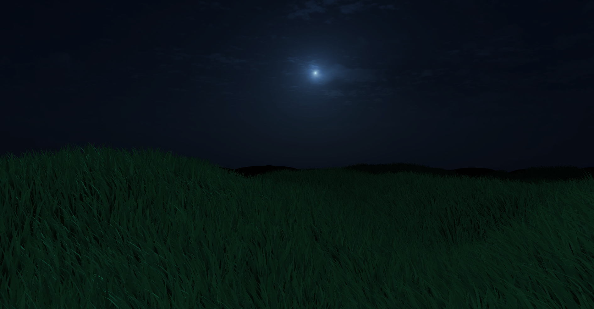

# OpenGL3DEngine Grassy Field

Experimental 3d engine made with OpenGL that I used to render a very very large field of grass blowing in the wind.

VIDEO DEMO:
https://youtu.be/I_EwUnXz0rI?si=6XgTICVtFB7aHnbP
